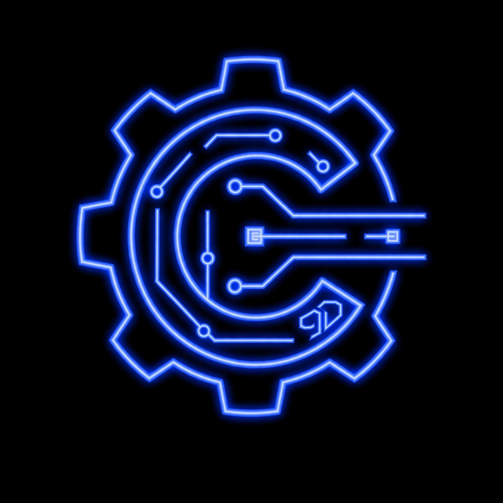

<div align="center">



# Cyx3rPatriX

### Programmer · Researcher · Builder

**Exploring code, cybersecurity, science, engineering and intelligent systems.**

<br>

[](https://github.com/Cyx3rPatriX)

</div>

---

## `> whoami`

I'm **Cyx3rPatriX** — a self-taught programmer, cybersecurity learner,
researcher, and builder interested in understanding how systems work,
breaking them down, and building better ones.

My interests span across:

- 💻 Programming & Software Engineering
- 🛡️ Cybersecurity & Pentesting
- 🔬 Research & Technical Investigation
- 🤖 Robotics & Intelligent Systems
- ⚙️ Mechatronics & Engineering
- 🧠 Artificial Intelligence
- 🐧 Linux & Systems
- 🎮 Game Development & Technology

I learn by **studying → experimenting → building → breaking → rebuilding**.

---

## `> current_mission`

> **Learn deeply. Build deliberately. Understand the system.**

I'm currently developing my foundations across programming, computer
systems, cybersecurity, mathematics, physics, engineering and robotics.

The long-term goal is simple:

**Become a systems-oriented engineer capable of understanding,
designing and building complex technology from the ground up.**

---

## `> what_i_build`

I prefer learning through real projects rather than isolated tutorials.

### 🛡️ APEX

**Advanced Penetration & Exploitation Platform**

An authorized security assessment platform designed around
learning, experimentation and structured security testing.

`Python` · `Expo` · `React Native` · `Tauri`

---

### 🧠 AXIOM / VERA

**A.X.I.O.M. — Adaptive eXecutive Intelligence & Operations Matrix**

**V.E.R.A. — Virtual Entity for Reasoning & Autonomy**

An experimental intelligent-system architecture exploring
reasoning, orchestration, autonomy and AI systems.

`Python` · `AI` · `Systems Architecture`

---

### ⚡ CYX_9D

A personal technology and learning ecosystem focused on:

**Cybersecurity · Science · Technology · Engineering · Programming**

CYX_9D represents the broader builder/researcher side of
my work outside this personal GitHub identity.

---

## `> tech_stack`

### Languages

<p>


</p>

### Systems & Tools

<p>


</p>

### Exploring

```text
Cybersecurity
Artificial Intelligence
Systems Architecture
Robotics
Mechatronics
Computer Science
Mathematics
Physics
Engineering
```

---

> learning_mode

              ┌─────────────────┐
              │        LEARN       │
              └────────┬────────┘
                         ↓
              ┌─────────────────┐
              │       RESEARCH     │
              └────────┬────────┘
                         ↓
              ┌─────────────────┐
              │      EXPERIMENT    │
              └────────┬────────┘
                         ↓
              ┌─────────────────┐
              │         BUILD      │
              └────────┬────────┘
                         ↓
              ┌─────────────────┐
              │        BREAK       │
              └────────┬────────┘
                       ↓
              ┌─────────────────┐
              │       IMPROVE      │
              └─────────────────┘


---

> github_activity

<div align="center"></div>

---

> My Philosophy

Understand the system.
Question the assumptions.
Build what you can.
Break what you build.
Learn from the failure.
Build it better.


---

> ecosystem

CYX_9D

My broader technology & learning ecosystem.

Cybersecurity • Science • Technology • Engineering • Programming

→ Explore CYX_9D

---

<div align="center">Cyx3rpatriX

Learn · Build · Break · Evolve

<br><sub>Built with curiosity. Driven by systems.</sub>

</div>
